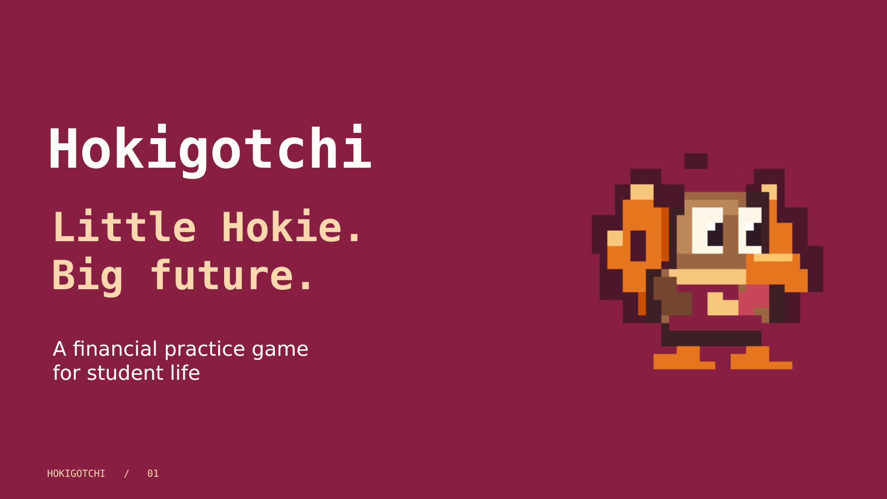
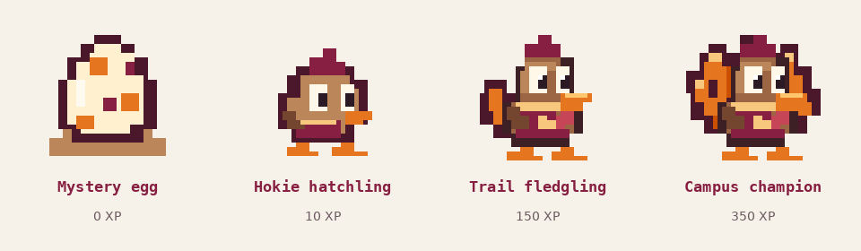
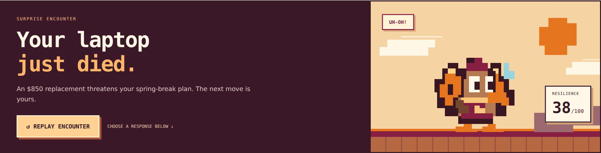
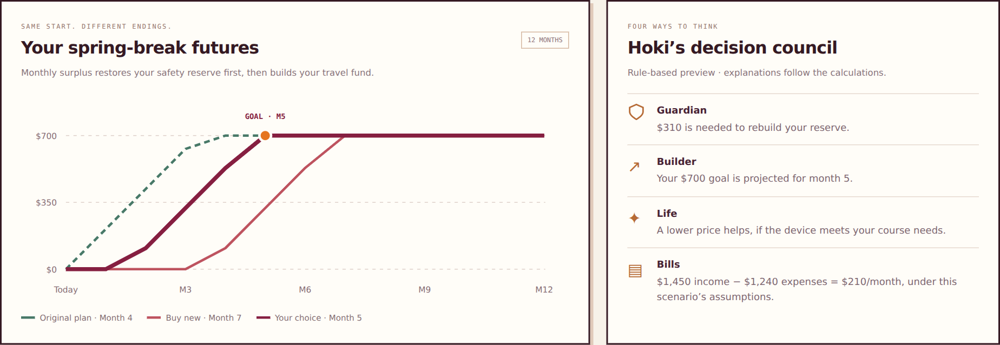

<p align="center">
  
</p>

<p align="center"><strong>A financial practice game for student life.</strong><br />Plan your week, track your spending, and help a little Hoki grow.</p>

<p align="center">
  <a href="docs/presentation/Hokigotchi-Pitch.pdf">Pitch deck</a> ·
  <a href="docs/DEMO-GUIDE.md">Demo guide</a> ·
  <a href="docs/FEATURES.md">Feature status</a> ·
  <a href="docs/SETUP.md">Setup</a>
</p>

## Why Hokigotchi?

A student can make a budget and still struggle with the next decision: an unexpected repair, a different week of expenses, or a savings goal that feels far away. Hokigotchi makes those decisions visible through a companion game and financial practice scenarios.

Useful actions earn progress. Recording spending, planning a week, and reaching new savings milestones help Hoki evolve. A replayable **Chaos Arena** lets players explore how a surprise expense changes their savings timeline before making a real purchase.

The prototype uses Virginia Tech-inspired maroon and orange, an original pixel-art bird companion, and Capital One Nessie sandbox balances. It is an independent student project.

## The experience

### Your habits grow Hoki



- **Weekly money quests:** allocate Food, Transport, Shopping, Bills, and Other separately each week, then compare recorded spending with money left.
- **Expense logging:** record an amount, description, and category. The first three eligible entries each day earn XP; bigger purchases do not earn bigger rewards.
- **Savings quests:** work toward a named goal and earn one-time bonuses at 25%, 50%, 75%, 90%, and 100% of the target.
- **Hoki's nest:** earn snacks, feed Hoki, track its mood, and progress through four evolution stages.
- **World map and outfits:** reach checkpoints, collect in-game tokens, and unlock cosmetic outfits.
- **Budget lab:** calculate a monthly plan and compare a different income or spending assumption.

Opening the app or signing in does not automatically award XP. See the [reward rules](docs/FEATURES.md#reward-rules) for caps and conditions.

### A surprise expense becomes a playable decision



In **Chaos Arena**, a laptop breakdown creates three possible responses. Each choice recalculates cash, reserve coverage, a learning resilience score, and a twelve-month savings projection.

| Sample response | Upfront cost | Month the $700 goal is funded |
| --- | ---: | ---: |
| Original plan, without the surprise | $0 | 4 |
| Buy a new laptop | $850 | 7 |
| Buy refurbished | $430 | 5 |
| Successful repair | $180 | 4 |

The example starts with $1,640 checking, $920 savings, $1,450 monthly income, and $1,240 monthly expenses. The $210 surplus restores an $800 reserve before funding the goal. The repair path assumes a diagnosis confirms that $180 will fix the laptop. These are scenario assumptions, not predictions or actual purchases.



The **decision council** explains the result from four perspectives: Guardian, Builder, Life, and Bills. This prototype uses rule-based explanations. It does not call a live AI model. Chaos practice XP is isolated from the main game and shared rankings.

### Your Hoki can travel with you

- Email-code sign-in through Supabase.
- Private cloud adventures with server-calculated rewards.
- Opt-in weekly rankings for points, expense-logging days, and check-in days.
- Nicknames and habit scores on the shared leaderboard; financial entries remain private.
- Separate device practice and cloud progress, with private practice backup and explicit restore.

Cloud game rules validate supported actions and reward limits. Expenses and savings remain self-reported. They are not verified bank transactions or proof for cash payouts.

## Try the demo

**Existing app:** start the development server and open [localhost:3000](http://localhost:3000).

**Chaos Arena:** open [localhost:3000/chaos](http://localhost:3000/chaos), click **UNLEASH CHAOS**, and choose a response. Before the encounter, **Use Nessie balances** can read the configured sandbox account endpoint. Sample balances remain explicitly labeled when no sandbox load succeeds.

**Offline backup:** download [Hokigotchi-Chaos-Offline.html](docs/demo/Hokigotchi-Chaos-Offline.html) and open it in a browser. It runs the same encounter with sample balances and no installation. GitHub displays the HTML source; download the file to run it.

`localhost` links work only while the app runs on your computer. This repository does not claim a public deployment.

## Run locally

Use Node.js 24 for the supplied native TypeScript tests. From the repository root:

```bash
cd web
npm install
```

Create `web/.env.local` with your own values:

```dotenv
NESSIE_API_KEY=your_nessie_api_key
NESSIE_BASE_URL=https://prod-api.nessieisreal.com
NESSIE_CUSTOMER_ID=your_sandbox_customer_id
NEXT_PUBLIC_SUPABASE_URL=https://your_project_ref.supabase.co
NEXT_PUBLIC_SUPABASE_PUBLISHABLE_KEY=your_publishable_key
SUPABASE_SECRET_KEY=your_server_secret_key
```

Configure the database and email-code templates using [SETUP.md](docs/SETUP.md). Then run:

```bash
npm run dev -- --port 3000
```

The Supabase secret and Nessie API key belong on the server. Keep `.env.local` out of Git. The offline Chaos file needs none of these credentials.

## How it works

| Layer | Responsibility |
| --- | --- |
| Next.js, React, TypeScript | App interface, API routes, money forms, and game views |
| Game rules | XP, tokens, milestones, weekly plans, and Hoki evolution |
| Budget engine | Monthly surplus and savings-goal comparisons |
| Chaos engine | Deterministic scenario projections using cents arithmetic |
| Capital One Nessie | Simulated checking and savings balances in practice mode |
| Supabase Auth and Postgres | Email-code accounts, private state, request receipts, and opted-in rankings |

The cloud API derives identity from a verified session and applies supported actions to saved state. Request IDs and revision checks help prevent repeated or racing saves from awarding twice. Database tables restrict direct browser access.

See [ARCHITECTURE.md](docs/ARCHITECTURE.md) for the implementation map and data boundaries.

## What is a preview?

| Capability | Status |
| --- | --- |
| Budgets, expense logs, savings milestones, pet growth | Implemented |
| Email-code accounts, cloud saves, opt-in rankings | Implemented; requires configured Supabase |
| Nessie account balances | Sandbox integration in practice mode |
| Chaos choices and future projections | Interactive scenario demo |
| Decision council | Rule-based preview |
| Coupons, cashback, and cash rewards | Catalog previews; no redemption or payouts |
| Individual bank connections for cloud users | Future work |
| AI-generated scenarios and explanations | Future work |
| Public hosting and production desktop distribution | Separate deployment work |

## Checks

From `web`, the existing project includes game and cloud tests:

```bash
node --test tests/fork-game.test.mjs tests/hoki-pet.test.mjs tests/money-quests.test.mjs tests/cloud-service.test.mjs tests/cloud-store.test.mjs tests/cloud-server.test.mjs
npx tsc --noEmit
npm run lint
npm run build
```

With the app and Supabase configured, `node scripts/check-cloud.mjs` exercises temporary accounts, authentication, private state, duplicate/racing saves, ranking opt-in, and backups. It creates and deletes test accounts. Run it against your development project.

The Chaos engine has additional tests at `web/tests/chaos.test.mjs`. Run them from `web` with `node --test tests/chaos.test.mjs`.

## Presentation materials

- [Editable PowerPoint](docs/presentation/Hokigotchi-Pitch.pptx)
- [PDF deck](docs/presentation/Hokigotchi-Pitch.pdf)
- [Five-minute pitch script](docs/PITCH-SCRIPT.md)
- [Live demo and backup guide](docs/DEMO-GUIDE.md)
- [Judge Q&A](docs/JUDGE-QA.md)
- [Submission copy](docs/SUBMISSION-COPY.md)
- [GitHub upload steps](docs/GITHUB-UPLOAD.md)

## Next chapter

Expand banking activity feeds, personalize practice scenarios, and test the experience with students. Explore campus reward partnerships only after defining funding, redemption, and verification. A pilot should measure return visits, useful logging, and understanding of tradeoffs before claiming financial impact.

**Little Hokie. Big future.**
